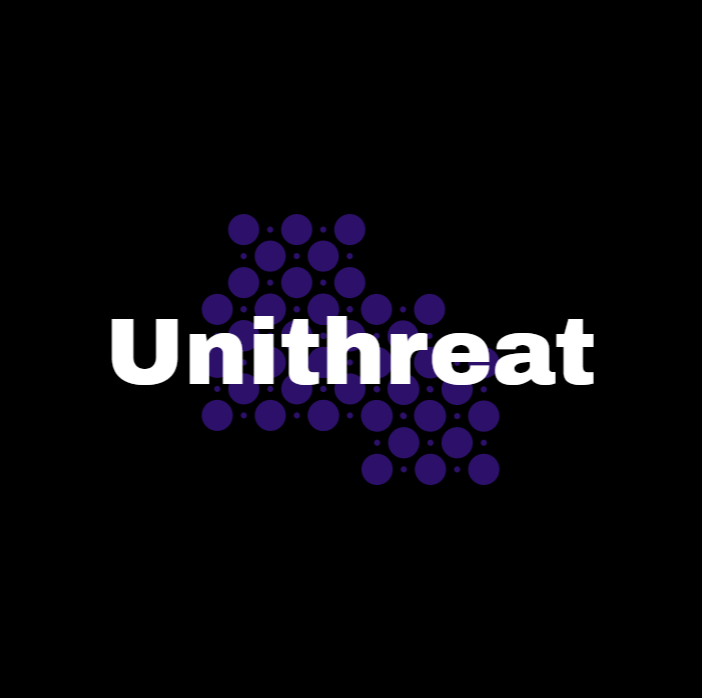

# 🛡️ UniThreat - Threat Intelligence Dashboard

**UniThreat** is a web-based Threat Intelligence Dashboard built with React and Express.js. It enables users to analyze IPs, URLs, file hashes, and domains using free open-source threat intelligence APIs such as AbuseIPDB, URLhaus, VirusTotal, and ThreatFox. This project is designed for security analysts, researchers, and enthusiasts to perform fast threat lookups and visualize results.

---

## ✨ Features

- 🔍 **IP Lookup** via [AbuseIPDB](https://www.abuseipdb.com/)
- 🌐 **URL Scan** using [URLhaus](https://urlhaus.abuse.ch/)
- 🧬 **Hash Analysis** via [VirusTotal](https://www.virustotal.com/)
- 🌎 **Domain Reputation** via [ThreatFox](https://threatfox.abuse.ch/)
- 🕘 **Search History** tracking
- 🧩 Clean and modern dashboard UI with easy navigation
- 🔐 Login & Registration system with bcrypt
- 📊 Visualizations and statistics

---

## 🚀 Getting Started

### Prerequisites

- Node.js & npm
- MongoDB (Local instance or Atlas)
- Internet connection (to call APIs)

---

### 🛠️ Installation

1. **Clone the repository**
   ```bash
   git clone https://github.com/yourusername/unithreat-dashboard.git
   cd unithreat-dashboard
   ```

2. **Install server dependencies**
   ```bash
   cd backend
   npm install
   ```
3. **Install frontend dependencies**
   ```bash
   cd ..
   npm install
   ```
4. **Environment Configurationy**
   ```bash
   PORT=5000
   MONGODB_URI=mongodb://localhost:27017/unithreat
   ABUSEIPDB_API_KEY=your_abuseipdb_api_key
   VIRUSTOTAL_API_KEY=your_virustotal_api_key
   ```
   
### 🔃 Running the Project
**Start the backend server:**
```bash
cd backend
node index.js
```
**Start the frontend:**
```bash
cd ..
npm run dev
```
